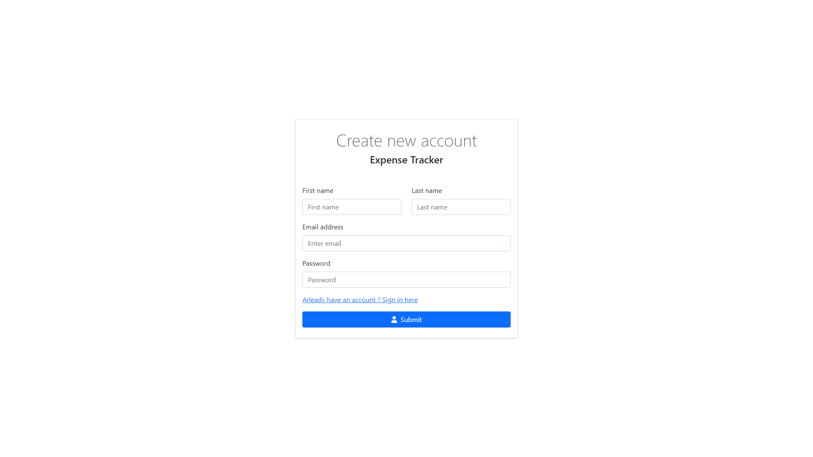

# Expense Tracker
Expense Tracker is application which allows you to keep track of your money balance. Users can add their expenses and income and see it in nice looking dashboard. Application shows user statistics of income and expenses against the backdrop of the entire budget.

# Live Preview
You can try this app here: https://expense-tracker-a34c8.web.app

# Screenshots preview 

 

 

# Tech Stack
+ React
+ Bootstrap
+ Redux Toolkit
+ Firebase
